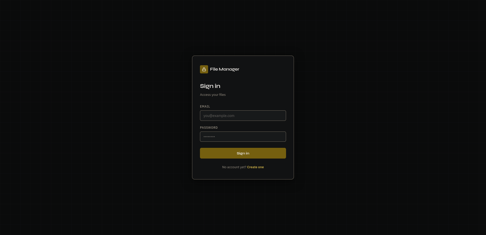
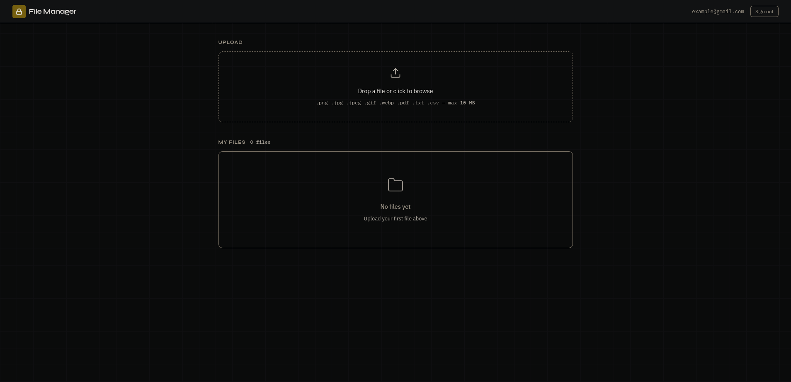

# File Manager - Teste para Dev Junior Pixel Breeders

Aplicação web full-stack para upload, listagem, download e exclusão de arquivos com controle de acesso por usuário autenticado.

Desenvolvimento:
    + Frontend: React + TypeScript + Vite;
    + Backend: Python + FastAPI;
    + Banco de Dados: SQLite via SQLAlchemy2;
    + Armazenamento de arquivos: Filesystem local (`backend/uploads/`);
    + Autenticação: JWT (Bearer token) + bcrypt.

## Funcionalidades implementadas

- Cadastro e login com email e senha;
- Sessão persistida via JWT no localStorage;
- Acesso restrito: cada usuário vê e opera apenas seus próprios arquivos
- Upload de arquivos com barra de progresso;
- Validação de tipo e tamanho no frontend e no backend;
- Listagem de arquivos com nome, tamanho e data de upload;
- Notificação de erros;
- Download com streaming;
- Exclusão (soft delete) com confirmação.

## Funcionalidades não implementadas (extras)

- Links compartilháveis;
- Preview de imagens;
- Implementação de cache;
- Uso de MinIO ou S3.


## Execução local

Pré-requisito [Docker](https://docs.docker.com/get-docker/) e [Docker Compose](https://docs.docker.com/compose/install/) instalados.

```bash
docker compose up --build
```

Aguarde o build e acesse http://localhost:5173.

Para encerrar:

```bash
docker compose down
```

Os arquivos enviados ficam em `backend/uploads/` e o banco em `backend/filemanager.db`, ambos persistidos no host via volume. Os dados sobrevivem ao restart do container.

## Descrição da arquitetura

## Arquitetura

```
| Caminho | Tipo | Descrição |
|---|---|---|
| `filemanager/` | Diretório raiz | Projeto principal |
| `docker-compose.yml` | Arquivo | Orquestração dos serviços |
| `backend/` | Pasta | Serviço Python |
| `backend/Dockerfile` | Arquivo | Build da imagem do backend |
| `backend/requirements.txt` | Arquivo | Dependências Python |
| `backend/main.py` | Arquivo | Entrypoint: app FastAPI, CORS e routers |
| `backend/database.py` | Arquivo | Engine SQLAlchemy + sessão + get_db |
| `backend/models.py` | Arquivo | ORM: User, FileRecord |
| `backend/schemas.py` | Arquivo | Schemas Pydantic (validação) |
| `backend/auth.py` | Arquivo | bcrypt, JWT e dependência get_current_user |
| `backend/routers/` | Pasta | Rotas da API |
| `backend/routers/auth.py` | Arquivo | POST /auth/register, POST /auth/login |
| `backend/routers/files.py` | Arquivo | CRUD de arquivos |
| `backend/uploads/` | Pasta | Armazena arquivos enviados (criada automaticamente) |
| `frontend/` | Pasta | Serviço React |
| `frontend/Dockerfile` | Arquivo | Build da imagem do frontend |
| `frontend/index.html` | Arquivo | HTML base |
| `frontend/src/` | Pasta | Código fonte React |
| `frontend/src/main.tsx` | Arquivo | Entrypoint React |
| `frontend/src/App.tsx` | Arquivo | Roteamento e proteção de rotas |
| `frontend/src/api/` | Pasta | Camada de comunicação com API |
| `frontend/src/api/client.ts` | Arquivo | Instância Axios com interceptors de auth |
| `frontend/src/api/auth.ts` | Arquivo | register(), login() |
| `frontend/src/api/files.ts` | Arquivo | list(), upload(), download(), delete() |
| `frontend/src/context/` | Pasta | Contextos globais |
| `frontend/src/context/AuthContext.tsx` | Arquivo | Estado global de autenticação |
| `frontend/src/pages/` | Pasta | Páginas da aplicação |
| `frontend/src/pages/LoginPage.tsx` | Arquivo | Tela de login |
| `frontend/src/pages/RegisterPage.tsx` | Arquivo | Tela de registro |
| `frontend/src/pages/DashboardPage.tsx` | Arquivo | Painel principal |
| `frontend/src/components/` | Pasta | Componentes reutilizáveis |
| `frontend/src/components/UploadZone.tsx` | Arquivo | Drag-and-drop com barra de progresso |
| `frontend/src/components/FileList.tsx` | Arquivo | Listagem com download e delete inline |
| `frontend/src/utils/` | Pasta | Utilitários |
| `frontend/src/utils/error.ts` | Arquivo | Extração de mensagem de erro da API |
| `frontend/src/utils/format.ts` | Arquivo | formatBytes, formatDate, mimeIcon |
| `frontend/package.json` | Arquivo | Dependências e scripts do frontend |
```

## Decisões técnicas

### Banco de dados — SQLite
Escolhido por não exigir nenhum serviço externo, o que simplifica tanto o setup local quanto o Docker.

### Autenticação — JWT stateless
O token é gerado no login, armazenado no `localStorage` do browser e enviado como `Bearer` em cada requisição. O backend valida a assinatura sem consultar o banco a cada request, o que mantém os endpoints leves. Validade de 24 horas.

### Hashing de senhas — bcrypt 
O projeto usa a biblioteca `bcrypt` especificamente para o hash das senhas, oferecendo segurança maior. Outra coisa é que ele possui a característica de senhas iguais terem hashes diferentes. 

### Armazenamento — Filesystem local
Arquivos salvos em `backend/uploads/` para simplificar a aplicação, com nomes baseados em UUID para evitar colisões e não expor o nome original no filesystem. 

### Download com streaming
O endpoint de download usa `StreamingResponse` com leitura em chunks de 64 KB via `aiofiles`. O uso de memória no servidor é constante independente do tamanho do arquivo.

### Exclusão — física + soft delete
O arquivo é removido do disco imediatamente. O registro no banco recebe `deleted = True`, preservando o histórico sem deixar arquivos órfãos no storage.

### Controle de acesso
Toda operação de arquivo verifica `record.owner_id == current_user.id` no backend antes de executar. Tentativas de acessar arquivos de outros usuários retornam `403 Forbidden`.

### Validação de upload
A extensão é validada no frontend antes de enviar, pois evita tráfego desnecessário. O backend revalida extensão e tipo MIME independentemente, nenhuma validação do cliente é confiada como definitiva.

## Screenshots





## Uso de IA

A aplicação utilizou a IA Claude Sonnet 4.5, que auxiliou com a organização dos componentes e folders e a testagem da autenticação de usuários. Assim como ajustes/solução de bugs da interface gráfica, criação de padrão quadriculado e logo.
